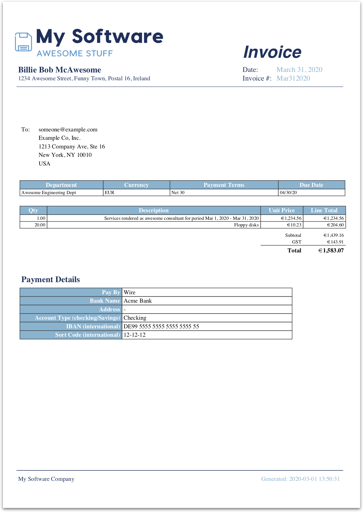

Billmonger
==========

Billmonger is a dead simple PDF one-page invoice generator written in Go. The
intention is to make the generated invoices look professional and have them be
repeatable. You can use your own company logo and two company colors as part of
the invoice, and each invoice is configurable with a single YAML file.

Billmonger makes many assumptions to keep things simple. Some of them
are:

 * You will have two company colors or use two generic colors
 * You will not invoice for more than about a dozen items
 * The billing period is a month (semi-configurable)
 * The bill due date is a month boundary
 * Everything on the bill is the same currency
 * Filenames will be output in a standard way

Current limitations:
 * It almost has support for tax calculation but it's not there yet

The Problem This Solves
------------------------

You have a small business and need to regularly generate bills, perhaps as a
contractor. Your bills are fairly similar but may have different line items.
This will generate a nice A4 PDF that looks professional and is easily
customizable to your business.

What It Looks Like
------------------

The sample `billing.example.yaml` file [provided](billing.example.yaml) will
generate a [PDF file](assets/example.pdf) that looks like this:



Configuration
-------------

Configuration is done in the YAML file (`billing.yaml` by default). This
describes the bill and the billables to be reported. It supports a couple of
templating features that make reporting items easier. These are Go template
functions and are to be put inside double curly braces anywhere in the YAML
file. Interpretation of the template happens _before_ YAML processing.
Examples:

 * `{{ endOfNextMonth }}`: This will be substituted with the end day of the
   month following the current month.
 * `{{ endOfThisMonth }}`: This will be substituted with the end day of the
   current month.
 * `{{ billingPeriod }}`: This will be substituted with the current month's
   beginning and end dates.

CLI Flags
---------

`billmonger` currently takes a single CLI flag, to tell it which config file
to use to run the bill. The default is `billing.yaml`, but you may specify
otherwise like so:

```bash
$ ./billmonger -c my-other-config.yaml
```

You may ask for help on the command line in the semi-standard way:

```bash
$ ./billmonger --help
usage: billmonger [<flags>]

Flags:
      --help            Show context-sensitive help (also try --help-long and
                        --help-man).
  -c, --config-file="billing.yaml"
                        The YAML config file to use
  -b, --billing-date="2019-12-29"
                        The date to assume the bill is written on
  -o, --output-dir="."  The output directory to use
  -a, --assets-dir="."  The assets directory to use
```

Using docker
------------

To build it and run it with docker you need to ...

* make the changes and then ...
* run `docker build . --tag billmonger` and then ...
* run `docker run --volume ${PWD}/billmonger/billings:/billings --volume ${PWD}/billmonger/assets:/assets billmonger --output-dir /billings --assets-dir /assets --config-file /billings/billing.example.yaml`

Note: The config file needs to be in a mounted dir (e.g. billings).

Note: To use the container in your environment you need to mount/configure the billings and assets dirs and you probably want to alias the docker run command (e.g. `alias='docker run --volume ${PWD}/billmonger/billings:/billings --volume ${PWD}/billmonger/assets:/assets billmonger --output-dir /billings --assets-dir /assets'`. With that you can run `billmonger --config-file /billings/billing.example.yaml`